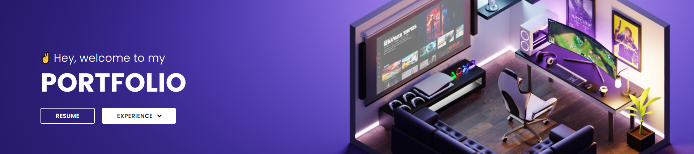

#  Hi

I am a Full Stack Software Developer and design enthusiast. I am passionate about technologies and love to learn new things.
 
 

## ⚡ Skills

Here are a few things I've picked up along my journey.

    

    

    

 
 
 
## 📫 Get in touch
 
